# Hadith Search Frontend Architecture Plan

## Overview

Transform the single-file [`Prototype.html`](frontend/src/Prototype.html) into a clean, component-based React + TypeScript application with enhanced UI/UX, Islamic aesthetics, and fake data — while preserving the original design vibe.

**Recent Enhancements (2026-05-07):**
- Multi-select dropdown filters for grades and books
- Dev/User Mode toggle with algorithm selection
- Light/Dark theme support with green as core identity

---

## 1. Project Setup & Tooling

### Tailwind CSS v3 Installation
The prototype uses Tailwind via CDN. The Vite project needs proper Tailwind integration:

- Install: `tailwindcss`, `postcss`, `autoprefixer`
- Create `tailwind.config.js` with the full Islamic color palette and typography from the prototype
- Create `postcss.config.js`
- Update [`index.css`](frontend/src/index.css) with `@tailwind` directives

### Fonts & Icons in [`index.html`](frontend/index.html)
Add Google Fonts and Material Symbols links:
- **Amiri** — Arabic hadith text
- **Newsreader** — Display headings and body
- **Manrope** — UI labels and captions
- **Material Symbols Outlined** — Icon set

---

## 2. File Structure

```
frontend/src/
├── App.tsx                    # Router + Layout shell
├── App.css                    # App-level styles (replace Vite defaults)
├── main.tsx                   # Entry point (already exists)
├── index.css                  # Tailwind directives + global styles
├── vite-env.d.ts
├── assets/
│   └── react.svg
├── types/
│   └── index.ts               # Shared TypeScript interfaces
├── data/
│   └── fakeData.ts            # Mock data for all pages
├── hooks/
│   └── useTheme.ts            # Theme management hook (light/dark mode)
├── components/
│   ├── Header.tsx             # Navbar with active route highlighting + theme toggle
│   ├── Footer.tsx             # Site footer
│   ├── SearchBar.tsx          # Search input with icon + button
│   ├── GradeFilter.tsx        # Grade buttons with color gradient (legacy)
│   ├── GradeMultiSelect.tsx   # Multi-select dropdown for grades (new)
│   ├── BookFilter.tsx         # Book selection grid with glow effect (legacy)
│   ├── BookMultiSelect.tsx    # Multi-select dropdown for books (new)
│   ├── MultiSelectDropdown.tsx # Reusable multi-select dropdown component (new)
│   ├── HadithCard.tsx         # Individual hadith result card
│   ├── HadithOfTheDay.tsx     # Featured hadith showcase on landing page
│   ├── AlgorithmCard.tsx      # Algorithm result card for dev mode
│   ├── BenchmarkTable.tsx     # Performance metrics table
│   ├── LoadingSpinner.tsx     # Islamic geometric spinner
│   ├── IslamicMotif.tsx       # Decorative geometric diamond element
│   ├── ThemeToggle.tsx        # Light/dark mode toggle button (new)
│   └── ModeToggle.tsx         # User/Dev mode toggle switch (new)
├── pages/
│   ├── HomePage.tsx           # Landing page with hero search
│   ├── ResultsPage.tsx        # Search results listing (legacy)
│   ├── UserModeResultsPage.tsx # User mode results page (new)
│   ├── DevModeResultsPage.tsx # Dev mode results page with algorithm selection (new)
│   ├── DevModePage.tsx        # Algorithm comparison view
│   ├── BenchmarksPage.tsx     # Algorithm benchmarks
│   └── LoadingPage.tsx        # Splash/loading screen
```

---

## 3. Component Architecture

```mermaid
graph TD
    App[App.tsx - Router + Layout]
    App --> Header[Header - Active Nav + Theme Toggle]
    App --> Routes[Routes]
    App --> Footer[Footer]
    
    Routes --> HP[HomePage]
    Routes --> URP[UserModeResultsPage]
    Routes --> DRP[DevModeResultsPage]
    Routes --> DP[DevModePage]
    Routes --> BP[BenchmarksPage]
    Routes --> LP[LoadingPage]
    
    HP --> IM[IslamicMotif]
    HP --> SB[SearchBar]
    HP --> GF[GradeFilter - Color Gradient]
    HP --> BF[BookFilter - Glow Highlight]
    HP --> HOTD[HadithOfTheDay - Standout Showcase]
    
    URP --> SB2[SearchBar]
    URP --> GMS[GradeMultiSelect - Multi-Select]
    URP --> BMS[BookMultiSelect - Multi-Select]
    URP --> HC[HadithCard - Multiple]
    URP --> MT[ModeToggle - User/Dev Switch]
    
    DRP --> SB3[SearchBar]
    DRP --> GMS2[GradeMultiSelect - Multi-Select]
    DRP --> BMS2[BookMultiSelect - Multi-Select]
    DRP --> HC2[HadithCard - Multiple]
    DRP --> MT2[ModeToggle - User/Dev Switch]
    DRP --> ASD[Algorithm Selection Dropdown]
    
    DP --> AC1[AlgorithmCard - Algorithm A]
    DP --> AC2[AlgorithmCard - Algorithm B]
    
    BP --> BT[BenchmarkTable]
    
    LP --> LS[LoadingSpinner]
    
    Header --> TT[ThemeToggle - Light/Dark]
```



---

## 4. TypeScript Types

```typescript
// types/index.ts

export type HadithGrade = 'sahih' | 'hasan-sahih' | 'hasan' | 'daif-hasan' | 'daif';

export interface Hadith {
  id: string;
  book: string;
  bookNumber: number;
  hadithNumber: number;
  grade: HadithGrade;
  arabicText: string;
  englishText: string;
  narrator: string;
  topic: string;
}

export interface Book {
  id: string;
  name: string;
  arabicName: string;
  hadithCount: number;
  description: string;
}

export interface AlgorithmResult {
  id: string;
  algorithmName: string;
  shortLabel: string;
  color: string;
  results: Hadith[];
}

export interface BenchmarkEntry {
  algorithmName: string;
  map: number;
  precisionAt10: number;
  recallAt100: number;
  ndcg: number;
}

// New types for enhanced features
export type SearchAlgorithm = 'bm25' | 'bm25-prf' | 'tf-idf' | 'hybrid';

export type ThemeMode = 'light' | 'dark' | 'system';

export interface MultiSelectOption {
  value: string;
  label: string;
  count?: number;
}
```

---

## 5. UI/UX Enhancement Details

### 5.1 Grade Color Gradient System

The grade buttons use a smooth color gradient from green to red:

| Grade | Color | Hex | Tailwind Class |
|-------|-------|-----|----------------|
| Sahih | Deep Green | #005129 | `bg-grade-sahih` |
| Hasan Sahih | Medium Green | #2d8a4e | `bg-grade-hasan-sahih` |
| Hasan | Amber/Gold | #9a7b00 | `bg-grade-hasan` |
| Daif Hasan | Orange | #c45000 | `bg-grade-daif-hasan` |
| Daif | Deep Red | #93000a | `bg-grade-daif` |

Each button gets:
- Background color from the gradient scale
- White text for contrast
- Subtle inner glow matching the grade color
- Scale-up animation on selection
- Checkmark icon when selected

### 5.2 Active Navbar State

- Current route link gets: `text-primary` color, `border-b-2 border-primary` underline, `font-semibold`
- Smooth transition between states with `transition-all duration-300`
- Small green dot indicator below active link
- Inactive links remain `text-on-surface-variant` with hover effect

### 5.3 Book Selection Highlight

- Books displayed as a horizontal scrollable row of cards
- Selected book card gets:
  - `ring-2 ring-primary` border glow
  - `bg-primary-container` background fill
  - `shadow-lg shadow-primary/20` elevated shadow
  - Subtle pulse animation on selection
- Unselected books remain flat with `bg-surface-container`

### 5.4 Islamic Aesthetic Touches

- **Girih pattern** background on DevMode page (already in prototype)
- **Geometric diamond motif** on homepage hero (rotated square element)
- **Star pattern** as logo icon (Material Symbols `star` filled)
- **Loading spinner** uses Islamic 8-pointed star SVG with slow rotation
- **Card hover effects** with green-tinted shadows: `shadow-[0_4px_20px_rgba(0,81,41,0.08)]`
- **Subtle border decorations** using `border-outline-variant` with occasional gold accents
- **Smooth page transitions** with fade-in animations
- **Arabic text** properly RTL-aligned with Amiri font at 28px

### 5.5 HadithOfTheDay Showcase

A visually striking featured hadith section on the landing page that draws the eye:

- **Container**: Full-width card with `bg-primary-container` deep green background and `text-on-primary-container` text
- **Decorative border**: Double gold border using `border-2 border-secondary-fixed-dim` with an inner `border` creating an Islamic frame effect
- **Layout**: Centered content with generous padding (`p-8 md:p-12`)
- **Label**: "Hadith of the Day" in `font-ui-label text-ui-label uppercase tracking-widest` with a small star icon, in gold `text-secondary-fixed-dim`
- **Arabic text**: Large Amiri font `font-body-arabic text-[32px]` RTL-aligned, with subtle text shadow for depth
- **English translation**: Below Arabic in `font-body-main text-body-main` with slight opacity
- **Attribution**: Book name + narrator in `font-ui-caption text-ui-caption` with gold accent
- **Grade badge**: Colored pill matching the grade system (e.g. green for Sahih)
- **Decorative elements**: Small IslamicMotif diamonds in corners, subtle girih pattern overlay at low opacity
- **Animation**: Gentle fade-in on page load with slight upward slide (`animate-fade-in-up`)
- **Responsive**: Stacks vertically on mobile, more spacious on desktop

### 5.6 Micro-interactions

- Search bar: Focus expands slightly with `ring-4 ring-secondary-container/30`
- Hadith cards: Hover lifts with shadow + border color shift to `primary-container`
- Grade buttons: Click ripple effect + scale bounce
- Book cards: Selection glow animation
- Nav links: Underline slides in from left on active

---

## 6. Fake Data Design

### Hadith Collection (8-10 entries)
Realistic hadith data covering different books, grades, and topics:
- Mix of Sahih Bukhari, Sahih Muslim, Sunan al-Tirmidhi, etc.
- All 5 grade levels represented
- Authentic Arabic text with English translations
- Various narrators and topics

### Books Collection (6 entries)
The 6 major hadith collections plus Muwatta Malik:
- Sahih al-Bukhari, Sahih Muslim, Jami al-Tirmidhi, Sunan Abu Dawud, Sunan al-Nasai, Sunan Ibn Majah
- Each with Arabic name, hadith count, and short description

### Algorithm Results (2 algorithms)
- BM25 + PRF with 3-4 result hadiths
- Neural Bi-Encoder with 3-4 result hadiths

### Hadith of the Day (1 featured entry)
- A carefully chosen well-known hadith with deep meaning
- Sahih grade, from a major collection
- Full Arabic text with English translation
- Narrator chain attribution

### Benchmark Data (4-5 algorithms)
- Cross-Encoder, BM25, Neural Bi-Encoder, TF-IDF, DPR
- MAP, P@10, R@100, NDCG metrics

---

## 7. Page-by-Page Breakdown

### HomePage
- Hero section with IslamicMotif diamond and title
- Full-width SearchBar with search icon and button
- GradeFilter row below search
- BookFilter grid below grades
- **HadithOfTheDay** standout showcase section below filters
- Popular/trending searches as clickable tags
- Subtle radial gradient background
- Theme toggle in header (light/dark mode)

### UserModeResultsPage (New)
- Compact SearchBar at top for refinement
- Mode toggle in top right (User/Dev switch)
- Multi-select GradeMultiSelect dropdown (multiple grades)
- Multi-select BookMultiSelect dropdown (multiple books)
- Results count + sort dropdown (includes authenticity sort)
- HadithCard list as main content
- Each card shows: book name, hadith number, grade badge, Arabic text, English translation, narrator
- Fixed algorithm endpoint (USER_MODE_ENDPOINT constant at top of file)
- No algorithm comparison features

### DevModeResultsPage (New)
- Compact SearchBar at top for refinement
- Mode toggle in top right (User/Dev switch)
- Multi-select GradeMultiSelect dropdown (multiple grades)
- Multi-select BookMultiSelect dropdown (multiple books)
- Algorithm selection dropdown (BM25, BM25 + PRF, TF-IDF, Hybrid)
- Results count + sort dropdown (includes authenticity sort)
- HadithCard list as main content
- Each card shows: book name, hadith number, grade badge, Arabic text, English translation, narrator
- "Compare Algorithms" button/link to DevModePage
- Display current algorithm being used

### DevModePage
- Query info bar at top
- Side-by-side AlgorithmCard columns
- Girih pattern background
- Each column: algorithm header with colored badge, list of result cards
- Algorithm comparison only available in Dev Mode

### BenchmarksPage
- Page title and description
- BenchmarkTable with all algorithms and metrics
- Highlighted best scores with `bg-primary-fixed` background
- Hover rows for readability

### LoadingPage
- Full-screen deep green background
- Centered Islamic 8-pointed star spinner
- App title below spinner
- Auto-redirects to home after 2 seconds

---

## 8. Tailwind Configuration

The full color palette from the prototype will be ported to `tailwind.config.js`, plus new grade colors and dark mode support:

```javascript
// Key additions beyond prototype colors:
colors: {
  // Grade colors (green to red gradient)
  'grade-sahih': '#005129',
  'grade-hasan-sahih': '#2d8a4e',
  'grade-hasan': '#9a7b00',
  'grade-daif-hasan': '#c45000',
  'grade-daif': '#93000a',
  
  // Light mode colors (warm, cream-based)
  'background': '#faf8f5',
  'surface': '#ffffff',
  'surface-container': '#f5f3f0',
  'surface-container-low': '#f5f3f0',
  'surface-container-high': '#eae8e5',
  'surface-container-highest': '#e4e2df',
  'primary': '#005129',
  'primary-container': '#1a6b3c',
  'on-primary': '#ffffff',
  'on-background': '#1b1c1a',
  'on-surface': '#1b1c1a',
  'on-surface-variant': '#404940',
  'outline': '#707a70',
  'outline-variant': '#bfc9be',
  'secondary': '#745b00',
  'secondary-container': '#fdd977',
  
  // Dark mode colors (deep forest green)
  'dark-background': '#0a1f12',
  'dark-surface': '#0d2818',
  'dark-surface-container': '#12331f',
  'dark-surface-container-low': '#0d2818',
  'dark-surface-container-high': '#1a3d26',
  'dark-surface-container-highest': '#254a31',
  'dark-primary': '#89d89e',
  'dark-primary-container': '#1a6b3c',
  'dark-on-primary': '#00210d',
  'dark-on-background': '#e2e3df',
  'dark-on-surface': '#e2e3df',
  'dark-on-surface-variant': '#c0c9c0',
  'dark-outline': '#8a938a',
  'dark-outline-variant': '#404940',
  'dark-secondary': '#e5c363',
  'dark-secondary-container': '#584400',
}
```

All existing prototype colors (primary, secondary, tertiary, surface variants, etc.) will be preserved exactly.

**Dark Mode Configuration:**
- `darkMode: 'class'` - Enables class-based dark mode
- Theme toggle adds/removes `dark` class on `<html>` element
- System preference detection on first load
- Manual override persisted in localStorage

---

## 9. Implementation Order

### Original Implementation (Completed)
1. **Infrastructure**: Install Tailwind, configure fonts, update index.html
2. **Types + Data**: Create TypeScript interfaces and fake data module
3. **Global Styles**: Update index.css and App.css
4. **Core Components**: Header, Footer, IslamicMotif, LoadingSpinner
5. **Search Components**: SearchBar, GradeFilter, BookFilter
6. **Content Components**: HadithCard, AlgorithmCard, BenchmarkTable
7. **Pages**: HomePage → ResultsPage → DevModePage → BenchmarksPage → LoadingPage
8. **App Shell**: Update App.tsx with routing and layout
9. **Polish**: Animations, transitions, responsive tweaks

### New Features Implementation (2026-05-07)

#### Phase 1: Infrastructure & Theme System
1. Create `useTheme.ts` hook for theme management
2. Create `ThemeToggle.tsx` component
3. Update `tailwind.config.js` with dark mode colors
4. Update `index.css` with CSS variables and dark mode styles
5. Initialize theme in `main.tsx`
6. Add `ThemeToggle` to `Header.tsx`

#### Phase 2: Multi-Select Components
1. Create `MultiSelectDropdown.tsx` reusable component
2. Create `GradeMultiSelect.tsx` component
3. Create `BookMultiSelect.tsx` component
4. Update `ResultsPage.tsx` to use multi-select components
5. Update filtering logic for multiple selections

#### Phase 3: Dev/User Mode
1. Create `ModeToggle.tsx` component
2. Create `UserModeResultsPage.tsx` with USER_MODE_ENDPOINT constant
3. Create `DevModeResultsPage.tsx` with algorithm dropdown
4. Update routing in `App.tsx`
5. Add mode toggle to results pages

#### Phase 4: Dark Mode Styling
1. Update all components with dark mode classes
2. Update all pages with dark mode classes
3. Test theme switching across all pages
4. Ensure green is prominent in both modes

#### Phase 5: Testing & Polish
1. Test multi-select functionality
2. Test mode switching
3. Test theme switching
4. Verify localStorage persistence
5. Verify system preference detection
6. Update documentation
